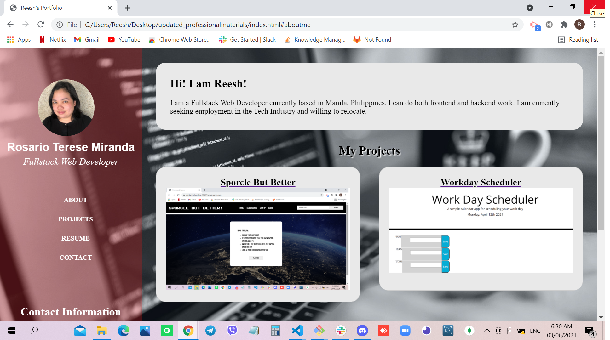

# Updated Professional Materials 

## Site Picture


## Technologies Used
- HTML - markup language for Web pages
- CSS -  language used to style an HTML document
- GitBash - for cloning repository and pushing code to GitHub
- GitHub - holds repository that deploys to GitHub Pages

## Summary
This file contains an updated professional materials portfolio. It also contains code that was created using HTML and CSS. 

## Code Snippet
```html
<div id="contacts" class="contact">
    <!-- input all contact information in footer -->
    <div class="contact_box">
        <h2>Contact Information</h2>
        <ul>
            <li>
                
                <a href="mailto:rtmiranda18@gmail.com">rtmiranda18@gmail.com</a>
            </li>
            <li>
                
                <p>+(63) 9175933526</p>
            </li>
            <li>
                
                <a href="https://github.com/rtmiranda18" target="_blank">Github</a>
            </li>
            <li>
                
                <a href="https://www.linkedin.com/in/rosario-miranda-b81170132" target="_blank">LinkedIn</a>
            </li>
        </ul>
    </div>
</div>
```

```html
<html>

</html>
```

## Author Links 
[LinkedIn](https://www.linkedin.com/in/rosario-miranda-b81170132/)<br />
[GitHub](https://github.com/rtmiranda18)

